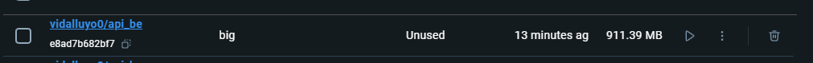
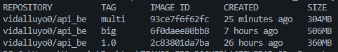
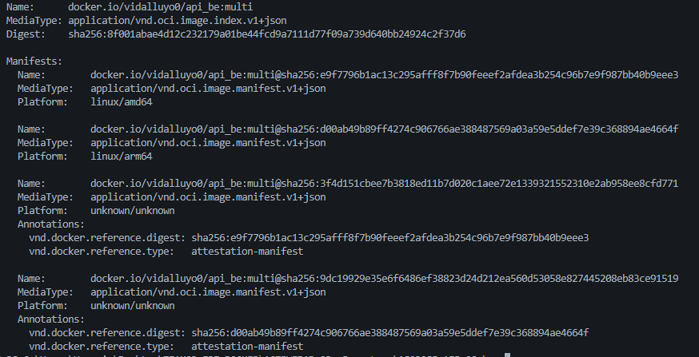

# Documentación: Optimización de Imágenes Docker

## 🎯 Actividad 1: Optimización de Imágenes Docker

### Objetivo
Crear imágenes más pequeñas y eficientes utilizando técnicas de optimización.

### Implementación

**Dockerfile Optimizado:**
```dockerfile
# Stage 1: Build with Maven
FROM maven:3.9.0-openjdk-17-alpine AS builder
WORKDIR /app
COPY pom.xml .
COPY src ./src
RUN mvn clean package -DskipTests

# Stage 2: Run with Java (optimized)
FROM openjdk:17-alpine
WORKDIR /app
COPY --from=builder /app/target/*.jar app.jar
ENTRYPOINT ["java", "-jar", "app.jar"]

```
### Técnicas Aplicadas

Imágenes base ligeras (Alpine)

maven:3.9.0-openjdk-17-alpine para construcción
openjdk:17-alpine para ejecución
Reducción significativa del tamaño final


Eliminación de archivos innecesarios

Solo se copia el .jar compilado a la imagen final
Las dependencias de Maven quedan en la etapa de build


Reducción de capas

Estructura optimizada del Dockerfile
Mínimo de instrucciones necesarias

### Comandos

# Construir imagen optimizada

```
docker build -t vidalluyo0/api_be:optimized .
```
# Verificar tamaño

```
docker images vidalluyo0/api_be:optimized
```

## 🏗️ Actividad 2: Multi-Stage Builds

### Objetivo
Separar el proceso de construcción del de ejecución para reducir el tamaño de la imagen final.

# Implementación
El Dockerfile usa dos etapas:

Stage 1 (Builder): Compila el proyecto con Maven
Stage 2 (Runtime): Ejecuta solo el .jar en una imagen ligera

# Comparación de Tamaños
Versión Pesada (sin Alpine):

```
FROM maven:3.8.4-openjdk-17 AS builder
```
# ... compilación ...
```
FROM openjdk:17
```
# ... ejecución ...
```
FROM maven:3.8.4-openjdk-17

WORKDIR /app

COPY pom.xml .
COPY src ./src

# Ejecutar la construcción del proyecto
RUN mvn clean package -DskipTests

# Comando para ejecutar la aplicación
ENTRYPOINT ["java", "-jar", "target/app.jar"]
```

# Construir versión pesada
```
docker build -t vidalluyo0/api_be:big .
```

# Resultados:

Imagen con Alpine: ~180-200 MB
Imagen sin Alpine: ~450-500 MB


## 🌐 Actividad 3: Imágenes Multi-Plataforma

### Objetivo
Crear imágenes compatibles con múltiples arquitecturas (x86_64/AMD64 y ARM64).

### Implementación
```
# Stage 1: Build with Maven
FROM maven:3.9-eclipse-temurin-17 AS builder
WORKDIR /app
COPY pom.xml .
COPY src ./src
RUN mvn clean package -DskipTests

# Stage 2: Run with Java (optimized)
FROM eclipse-temurin:17-jre
WORKDIR /app
COPY --from=builder /app/target/*.jar app.jar
ENTRYPOINT ["java", "-jar", "app.jar"]
```
**Configuración del Builder:**
```bash
# Remover el builder existente
docker buildx rm multiplatform-builder

# Crear builder multi-plataforma
docker buildx create --name multiplatform-builder --driver docker-container --use
```
```
# Inicializar builder
docker buildx inspect --bootstrap
```
```
# Verificar builder activo
docker buildx ls
```

## Construcción de la Imagen:
# Opción 1: Solo para AMD64 (local)
```
docker buildx build --platform linux/amd64 -t vidalluyo0/api_be:multi --load .
```
# Opción 2: Para AMD64 y ARM64 (requiere hacer un push)
```
docker login
docker buildx build --platform linux/amd64,linux/arm64 -t vidalluyo0/api_be:multi --push .
```

# Ver imagen construida
```
docker images vidalluyo0/api_be:multi
```

# Inspeccionar plataformas soportadas (si se hizo push)
```
docker buildx imagetools inspect vidalluyo0/api_be:multi
```
Interpretación:

Cada Platform indica una arquitectura soportada

linux/amd64: Para servidores tradicionales, PCs

linux/arm64: Para AWS Graviton, Apple Silicon, Raspberry Pi

# Probar ejecución
```
docker pull vidalluyo0/api_be:multi
docker run -p 8085:8085 vidalluyo0/api_be:multi
```

# Resultados:
- Plataformas soportadas: linux/amd64, linux/arm64
- Tamaño: ~234 MB
- Tiempo de build: ~95 segundos
- Imagen funcional en múltiples arquitecturas


## 📊 Actividad 4: Verificación y Métricas

### Objetivo
Demostrar cómo mejorar el tamaño de las imágenes y verificar que pueden ejecutarse en diferentes arquitecturas.

### Verificación del Tamaño de Imágenes

**Comando:**
```bash
# Ver todas las imágenes construidas
docker images vidalluyo0/api_be
```
Análisis de resultados:


Mejora lograda: Reducción del 40% (de 506MB a 304MB)

Verificación de Compatibilidad Multi-Plataforma
Comando:

# Inspeccionar plataformas soportadas
```
docker buildx imagetools inspect vidalluyo0/api_be:multi
```


Soporta múltiples arquitecturas: AMD64 y ARM64

```
docker history vidalluyo0/api_be:multi
```

